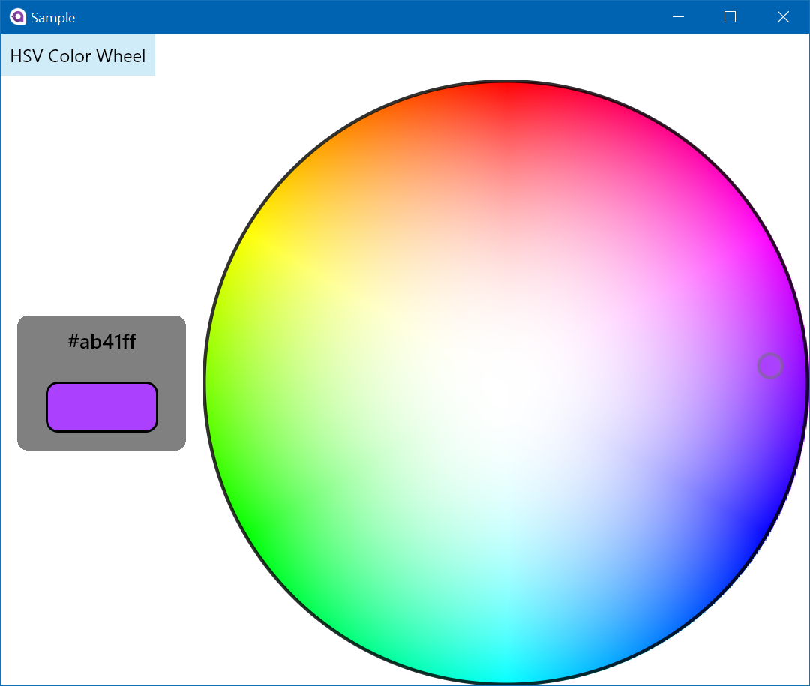

# Avalonia Color Picker
An Avalonia Color Picker. Includes a HSV color wheel, CIE views and Sketch like pickers. 

## Update
This project has been picked up by [Aura.UI](https://github.com/PieroCastillo/Aura.UI). I'd recommend using that library instead :) 


<p align="center">
  <a href="https://mikecodes.net">
    
  </a>  
</p>


## Getting Started 

### Import the XAML namespaces 
```

xmlns:cp="clr-namespace:ColorPicker;assembly=ColorPicker"	

```

### HSV Color Wheel 
```
<cp:ColorWheel ThumbSize="24" 
               SelectedColor="{Binding SelectedColor}" />
```

## Provided Converters
* RGBColor To Hex
* RGBColor To SolidBrush 
