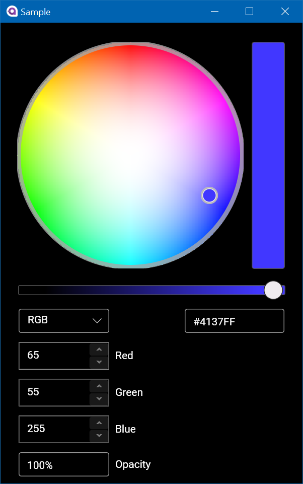
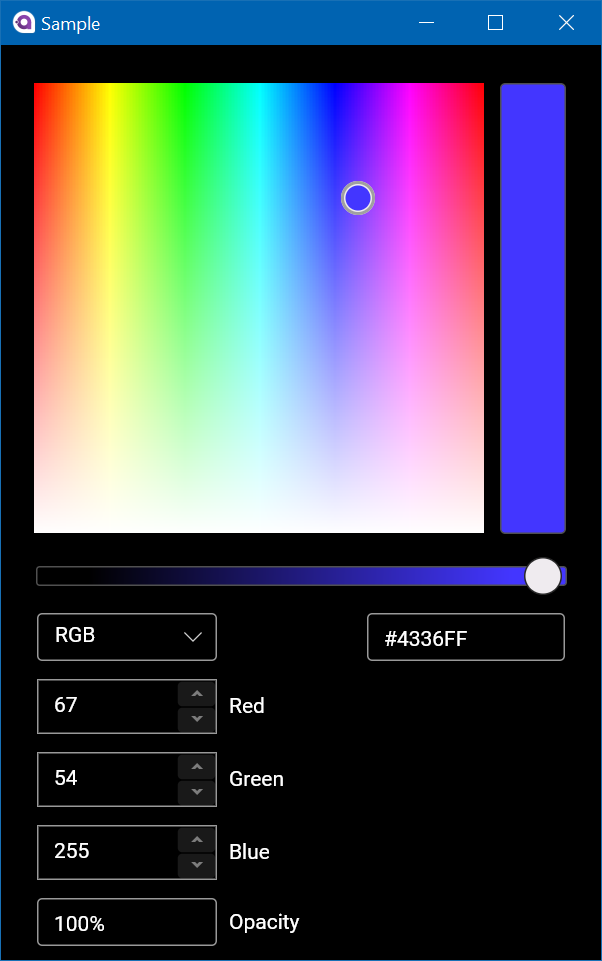
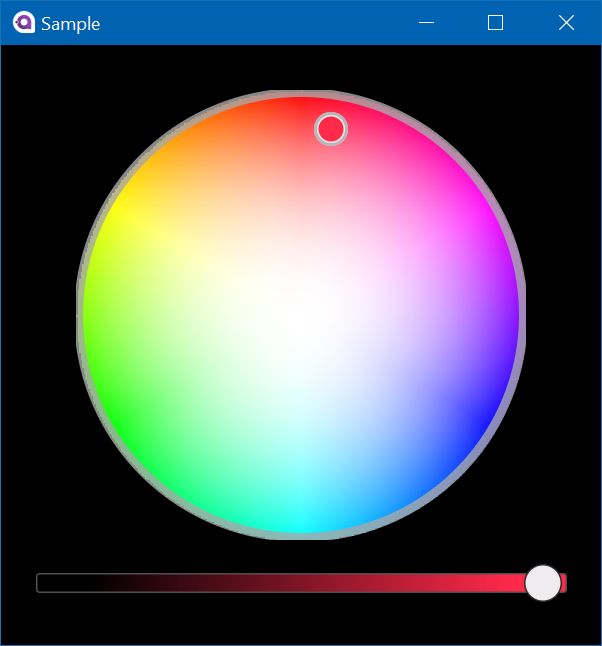

# Avalonia Color Picker
Avalonia Color Picker with a similar API to the [WinUI  Color Picker ](https://docs.microsoft.com/uwp/api/microsoft.ui.xaml.controls.colorpicker?view=winui-2.4&WT.mc_id=blog-avalonia-mijam) control. 


# Getting Started 

## Import the XAML namespaces 
```

xmlns:cp="clr-namespace:ColorPicker;assembly=ColorPicker"	

```
---
## Color Spectrum Shape
###  Ring



```
<cp:ColorPicker ColorSpectrumShape="Ring"/>
```

###  Box


```
<cp:ColorPicker ColorSpectrumShape="Box"/>
```
---

## Options

#### Hex Textbox Visibility
Hides the Hex textbox.
```
IsHexInputVisible="False"
```

#### Color Preview Visibility
Hides the preview color (on the right hand side).
```
IsColorPreviewVisible="False"
```

#### Color Channel Text Input Visibility
Hides the numeric text boxes and color space dropdown 
```
IsColorChannelTextInputVisible="False"
```

#### Alpha Text Input Visibility
Hides the numeric text boxes for opacity
```
IsAlphaTextInputVisible="False"
```

#### Value Scrolling Enabled 
Toggles the ability to change numeric values with  mouse scroll changes
```
IsValueScrollingEnabled="False"
```

#### Disabled All Options
With all the options disabled, the color picker will look like this:



```
<cp:ColorPicker ColorSpectrumShape="Ring" 
                IsHexInputVisible="False" 
                IsColorPreviewVisible="False"
                IsValueScrollingEnabled="False"
                IsColorChannelTextInputVisible="False"
                IsAlphaTextInputVisible="False"/>
```

